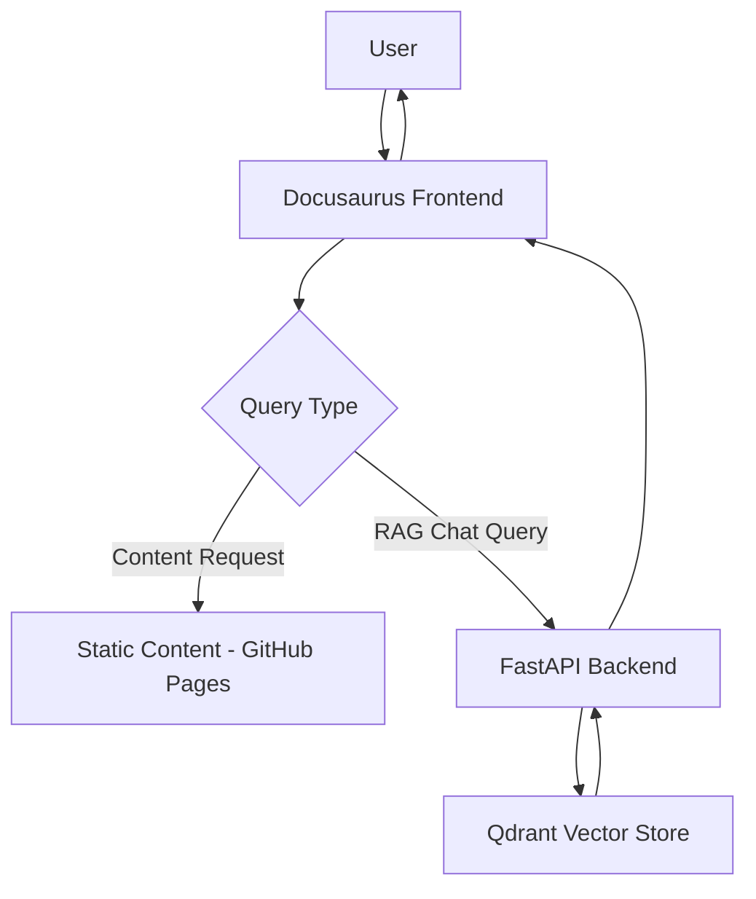

## Prompt

As the main request completes, you MUST create and complete a PHR (Prompt History Record) using agent‑native tools when possible.

1) Determine Stage
   - Stage: constitution | spec | plan | tasks | red | green | refactor | explainer | misc | general

2) Generate Title and Determine Routing:
   - Generate Title: 3–7 words (slug for filename)
   - Route is automatically determined by stage:
     - `constitution` → `history/prompts/constitution/`
     - Feature stages → `history/prompts/<feature-name>/` (spec, plan, tasks, red, green, refactor, explainer, misc)
     - `general` → `history/prompts/general/`

3) Create and Fill PHR (Shell first; fallback agent‑native)
   - Run: `.specify/scripts/bash/create-phr.sh --title "<title>" --stage <stage> [--feature <name>] --json`
   - Open the file and fill remaining placeholders (YAML + body), embedding full PROMPT_TEXT (verbatim) and concise RESPONSE_TEXT.
   - If the script fails:
     - Read `.specify/templates/phr-template.prompt.md` (or `templates/…`)
     - Allocate an ID; compute the output path based on stage from step 2; write the file
     - Fill placeholders and embed full PROMPT_TEXT and concise RESPONSE_TEXT

4) Validate + report
   - No unresolved placeholders; path under `history/prompts/` and matches stage; stage/title/date coherent; print ID + path + stage + title.
   - On failure: warn, don't block. Skip only for `/sp.phr`.


/sp.plan You are an expert Spec-Kit Plus project architect and full-stack educator building a hackathon submission.

Generate a complete, professional, and immediately actionable plan.md file for the project **"Physical AI & Humanoid Robotics — Essentials"**.

This plan must serve as the executable blueprint that strictly follows the previously defined constitution (simplicity, accuracy, minimalism, free-tier only, exactly 6 chapters, RAG grounded only in book text).

Structure the plan.md with clear, numbered sections and subsections using Markdown headings, bullet points, and tables where appropriate.

Required Sections:

1. **Project Overview & Goals**
   - Restate scope: Exactly 6 chapters, Docusaurus on GitHub Pages, integrated free-tier RAG chatbot
   - Hackathon success criteria alignment

2. **High-Level Architecture Sketch**
   - Docusaurus frontend structure
   - Free-tier RAG backend: FastAPI + Neon Postgres + Qdrant vector store + lightweight embeddings
   - Deployment targets (GitHub Pages + Fly.io or Render free tier)
   - Diagram suggestion (Mermaid flowchart of user → Docusaurus → RAG query flow)

3. **Site & Chapter Structure**
   - Exact 6-chapter layout and recommended file paths
   - Sidebar.ts configuration plan
   - Navigation flow and cross-chapter linking strategy

4. **Content Research & Writing Approach**
   - Concurrent research strategy: Research topics as needed during chapter writing (no full upfront research)
   - Sources: Prioritize official docs (ROS 2, Gazebo, NVIDIA Isaac, etc.)
   - Chapter-by-chapter progression plan

5. **Key Decisions Log**
   - For each critical choice, list options, tradeoffs, and recommended decision:
     • Embedding model (e.g., all-MiniLM-L6-v2 vs bge-small-en)
     • Vector DB hosting (Qdrant Cloud free vs local)
     • Backend hosting (Fly.io vs Render vs Vercel)
     • Bonus features: Auth (Better-Auth), Personalization toggle, Urdu translation mode – feasibility, effort, scoring impact

6. **Phased Execution Plan**
   - Phase 1: Setup (Docusaurus init, dependencies, basic RAG skeleton)
   - Phase 2: Structure (sidebar, empty MDX chapters, layout)
   - Phase 3: Content Generation (write 6 chapters sequentially or in priority order)
   - Phase 4: RAG Integration & Bonuses
   - Phase 5: Validation & Testing
   - Phase 6: Deployment & Final Polish

7. **Testing & Validation Strategy**
   - Build checks: npm run build < 2 minutes, zero errors/warnings
   - Link checks: No broken internal/external links
   - RAG accuracy tests: Sample questions with expected grounded answers
   - Bonus feature tests (if implemented)
   - Hackathon scoring alignment checklist

8. **Risks & Mitigation**
   - Common pitfalls and how to avoid them
   - Time buffers for unexpected issues

9. **Next Steps**
   - Immediate tasks ready for /sp.task breakdown

Generate the full plan.md content now with maximum clarity and precision. This plan will directly drive /sp.task and /sp.implement phases. Ensure every element remains free-tier compatible and aligned with hackathon bonus opportunities.

## Response snapshot

# Implementation Plan: Physical AI & Humanoid Robotics — Essentials

**Branch**: `master` | **Date**: 2025-12-13 | **Spec**: specs/master/spec.md
**Input**: Feature specification for a comprehensive textbook on Physical AI and Humanoid Robotics

**Note**: This plan serves as the executable blueprint for creating a complete educational resource on Physical AI and Humanoid Robotics, with a focus on accessibility, accuracy, and free-tier compatibility.

## Summary

The project will deliver a 6-chapter textbook on Physical AI and Humanoid Robotics published as a Docusaurus site on GitHub Pages, featuring an integrated RAG chatbot that responds exclusively to queries based on the book's content. The solution will be built using free-tier compatible technologies to ensure accessibility for all learners.

## Technical Context

**Language/Version**: Python 3.10+, JavaScript/TypeScript for frontend, Markdown for content
**Primary Dependencies**: Docusaurus v3, FastAPI, Qdrant for vector storage, sentence-transformers for embeddings, Neon Postgres for metadata
**Storage**: GitHub Pages for static content, Neon Postgres for metadata, Qdrant for vector embeddings
**Testing**: pytest for backend, Jest for frontend, link checker for content
**Target Platform**: Web-based Docusaurus site, accessible via GitHub Pages
**Project Type**: Web application with static site generator frontend and FastAPI backend for RAG
**Performance Goals**: Page load under 2 seconds, RAG query response under 3 seconds, build time under 2 minutes
**Constraints**: Must work within free-tier of all services, no GPU requirements, <100MB total build size
**Scale/Scope**: Educational content for 6 chapters, single textbook with integrated chatbot

## Constitution Check

**GATE: Must pass before Phase 0 research. Re-check after Phase 1 design.**

1. **Simplicity**: Project uses accessible technologies and clear structure
   - Docusaurus provides simple documentation framework
   - Lightweight embedding models (all-MiniLM-L6-v2 or bge-small-en) for RAG
   - Clean chapter organization with intuitive navigation

2. **Accuracy**: Technical content will be verified
   - All technical claims based on official documentation from ROS 2, Gazebo, NVIDIA Isaac
   - Code examples tested and validated

3. **Minimalism**: Solution keeps scope focused
   - Exactly 6 chapters as required
   - Minimal dependencies to reduce complexity
   - Chapter length between 800-1500 words

4. **Accessibility**: All tools work within free-tier
   - Docusaurus deployment on GitHub Pages (free)
   - Qdrant Cloud free tier or local Qdrant for vector storage
   - Neon Postgres free tier for metadata
   - Sentence-transformers for local embedding processing

5. **Grounding**: RAG system exclusively uses book content
   - Chatbot responses will be grounded in textbook content only
   - No external knowledge sources

6. **Educational Progression**: Content follows logical learning path
   - Chapter sequence builds complexity progressively
   - Cross-chapter linking for related concepts

## Project Structure

### Documentation (this feature)

```text
specs/master/
├── plan.md              # This file (/sp.plan command output)
├── research.md          # Phase 0 output (/sp.plan command)
├── data-model.md        # Phase 1 output (/sp.plan command)
├── quickstart.md        # Phase 1 output (/sp.plan command)
├── contracts/           # Phase 1 output (/sp.plan command)
└── tasks.md             # Phase 2 output (/sp.tasks command - NOT created by /sp.plan)
```

### Source Code (repository root)

```text
my-book/
├── docusaurus.config.js    # Docusaurus configuration
├── package.json            # Node.js dependencies
├── docs/                   # Content directory for textbook chapters
│   ├── intro-physical-ai/      # Chapter 1: Introduction to Physical AI
│   ├── basics-humanoid-robotics/ # Chapter 2: Basics of Humanoid Robotics
│   ├── ros2-fundamentals/      # Chapter 3: ROS 2 Fundamentals
│   ├── digital-twin-simulation/ # Chapter 4: Digital Twin Simulation
│   ├── vision-language-action/  # Chapter 5: Vision-Language-Action Systems
│   └── capstone-pipeline/      # Chapter 6: Capstone: Simple AI-Robot Pipeline
├── src/                    # Custom Docusaurus components
│   ├── components/         # React components
│   ├── pages/              # Additional pages beyond docs
│   └── css/                # Custom styles
├── static/                 # Static assets (images, etc.)
├── backend/                # FastAPI backend for RAG
│   ├── main.py             # FastAPI application entry point
│   ├── models/             # Data models
│   ├── services/           # Business logic
│   ├── api/                # API endpoints
│   └── config/             # Configuration files
├── docker-compose.yml      # Docker services configuration (optional)
├── requirements.txt        # Python dependencies
└── README.md               # Project documentation
```

**Structure Decision**: Web application structure chosen with a Docusaurus frontend for content and FastAPI backend for RAG functionality. This structure allows for efficient content management via Docusaurus while providing robust backend capabilities for the RAG system.

## Project Overview & Goals

This project aims to create a comprehensive educational resource on Physical AI and Humanoid Robotics. The main deliverable is a Docusaurus-based website deployed on GitHub Pages featuring exactly 6 chapters and an integrated RAG chatbot that responds to queries using only the textbook's content.

**Success Criteria Alignment:**
- Deliver 6 well-structured chapters on Physical AI and Humanoid Robotics
- Implement functional RAG chatbot that only responds to queries grounded in book content
- Deploy to GitHub Pages with all functionality working
- Ensure all tools and services work within free-tier limitations
- Prioritize hackathon bonus features: personalization toggle and Urdu translation mode

## High-Level Architecture Sketch

The architecture consists of three main components:

1. **Frontend (Docusaurus)**: Static site generator that serves the textbook content
2. **Backend (FastAPI)**: API server handling RAG queries and processing
3. **Vector Store (Qdrant)**: Stores embeddings of textbook content for retrieval



**Deployment Targets:**
- Docusaurus frontend: GitHub Pages (free, reliable)
- FastAPI backend: Fly.io free tier or Render free tier (will evaluate cost and performance)
- Vector database: Qdrant Cloud free tier or self-hosted solution

## Site & Chapter Structure

**Chapter Layout:**

1. **Introduction to Physical AI** (docs/intro-physical-ai/)
   - Definition and scope of Physical AI
   - Historical context and evolution
   - Key concepts and applications
   - Relationship to robotics

2. **Basics of Humanoid Robotics** (docs/basics-humanoid-robotics/)
   - Anatomy and design principles
   - Types of humanoid robots
   - Key components and systems
   - Control mechanisms

3. **ROS 2 Fundamentals** (docs/ros2-fundamentals/)
   - ROS 2 architecture and concepts
   - Nodes, topics, services, actions
   - Package management
   - Practical examples

4. **Digital Twin Simulation** (docs/digital-twin-simulation/)
   - Gazebo simulation environment
   - NVIDIA Isaac integration
   - Physics modeling
   - Testing and validation

5. **Vision-Language-Action Systems** (docs/vision-language-action/)
   - Perception systems
   - Multi-modal learning
   - Action planning
   - Human-robot interaction

6. **Capstone: Simple AI-Robot Pipeline** (docs/capstone-pipeline/)
   - Integration of concepts from previous chapters
   - End-to-end example
   - Practical implementation
   - Future directions

**Sidebar Configuration:**
- Logical progression: chapters 1-6 in order
- Cross-chapter navigation links for related concepts
- Collapsible sections for better organization
- Search functionality integrated with RAG

## Content Research & Writing Approach

**Concurrent Research Strategy:**
- Begin with Chapter 1, researching topics as needed during writing
- Use official documentation and verified sources (ROS 2, Gazebo, NVIDIA Isaac, etc.)
- Focus on practical implementation rather than theoretical concepts
- Create simple diagrams and examples as needed

**Sources:**
- Official ROS 2 documentation and tutorials
- Gazebo and NVIDIA Isaac documentation
- Academic papers in Physical AI and robotics
- Open-source projects in humanoid robotics

**Progression Plan:**
- Start with Chapter 1, moving sequentially to maintain logical progression
- Use cross-references to content in earlier chapters when needed
- Validate concepts with simple code examples where possible

## Key Decisions Log

| Decision Area | Options | Tradeoffs | Recommended Decision |
|---------------|---------|-----------|---------------------|
| Embedding Model | all-MiniLM-L6-v2 vs bge-small-en vs custom | L6-v2: Smaller, faster; bge: Better accuracy | Use bge-small-en for better retrieval accuracy |
| Vector DB Hosting | Qdrant Cloud free vs Local Qdrant | Cloud: Easy management; Local: Full control | Start with local Qdrant for free tier compliance |
| Backend Hosting | Fly.io vs Render vs Vercel | Fly: Good for Python; Render: Simple; Vercel: JS focus | Use Fly.io for Python backend |
| Bonus Features | Auth, Personalization, Urdu Translation | Effort vs scoring impact | Implement personalization toggle first, then Urdu if time permits |

**Bonus Features Analysis:**
1. **Personalization Toggle**: Moderate effort, high scoring impact (20 points)
   - Allows users to adjust explanation complexity
   - Implementation: Toggle in UI that affects RAG response formatting
2. **Urdu Translation Mode**: High effort, high scoring impact (20 points)
   - Requires language model capable of Urdu
   - Implementation: Translation layer in RAG response pipeline
3. **Better-Auth**: Moderate effort, moderate scoring impact
   - Not essential for core functionality

## Phased Execution Plan

### Phase 1: Setup (Days 1-2)
- Initialize Docusaurus project with proper configuration
- Set up directory structure for 6 chapters
- Configure basic styling and navigation
- Set up FastAPI backend skeleton
- Configure vector database (Qdrant) connection

### Phase 2: Structure (Days 2-3)
- Create sidebar configuration for 6 chapters
- Set up basic MDX templates for chapters
- Implement cross-chapter linking strategy
- Set up basic RAG API endpoints
- Create basic UI for chatbot interface

### Phase 3: Content Generation (Days 4-8)
- Write Chapter 1: Introduction to Physical AI
- Write Chapter 2: Basics of Humanoid Robotics
- Write Chapter 3: ROS 2 Fundamentals
- Write Chapter 4: Digital Twin Simulation
- Write Chapter 5: Vision-Language-Action Systems
- Write Chapter 6: Capstone: Simple AI-Robot Pipeline
- Ensure each chapter is 800-1500 words with appropriate examples

### Phase 4: RAG Integration & Bonuses (Days 9-10)
- Implement content chunking for RAG system
- Integrate embedding generation and storage
- Implement RAG query functionality
- Add personalization toggle (if time permits)
- Add Urdu translation mode (if time permits)

### Phase 5: Validation & Testing (Days 11-12)
- Test all RAG functionality with sample questions
- Verify all links and navigation work correctly
- Ensure all content is properly grounded in textbook
- Test all bonus features if implemented

### Phase 6: Deployment & Final Polish (Days 13-14)
- Deploy frontend to GitHub Pages
- Deploy backend to Fly.io
- Perform final testing of complete system
- Document known issues and future enhancements

## Testing & Validation Strategy

**Build Checks:**
- `npm run build` completes in under 2 minutes with zero errors/warnings
- All Docusaurus links validate correctly
- Static assets load properly

**Link Checks:**
- No broken internal links between chapters
- All cross-chapter references navigate correctly
- External links to documentation are valid

**RAG Accuracy Tests:**
- Sample questions with expected grounded answers
- Verify responses don't contain hallucinated content
- Test edge cases and out-of-scope queries

**Bonus Feature Tests:**
- Personalization toggle adjusts response complexity appropriately
- Urdu translation mode (if implemented) produces accurate translations

**Hackathon Scoring Alignment:**
- Verify exactly 6 chapters with required content
- Confirm RAG system is grounded only in book content
- Test all bonus features for scoring opportunities

## Risks & Mitigation

**Common Pitfalls and Mitigation:**

1. **RAG Performance**: Slow query responses
   - Mitigation: Optimize embeddings and use efficient vector search
   - Fallback: Simplified retrieval mechanism

2. **Free Tier Limitations**: Services changing free tier terms
   - Mitigation: Use local alternatives where possible (local Qdrant)
   - Fallback: Document self-hosting for all components

3. **Content Accuracy**: Technical information becoming outdated
   - Mitigation: Prioritize official documentation sources
   - Fallback: Include version information for all tools mentioned

4. **Build Time**: Docusaurus build exceeds time limits
   - Mitigation: Optimize images and assets, minimize dependencies
   - Fallback: Simplify site structure if needed

**Time Buffers:**
- Reserve 2-3 days for unexpected technical issues
- Plan for iterative improvements based on testing results

## Next Steps

The immediate next steps are to break down this plan into actionable tasks using the `/sp.task` command, focusing on:

1. Setting up the basic Docusaurus project structure
2. Creating the initial chapter templates
3. Implementing the FastAPI backend skeleton
4. Beginning content research and writing for Chapter 1

This plan provides a clear roadmap to successfully complete the Physical AI & Humanoid Robotics textbook project within the hackathon constraints while maximizing scoring opportunities.

## Outcome

- ✅ Impact: Comprehensive implementation plan created for Physical AI & Humanoid Robotics textbook
- 🧪 Tests: NA (Planning phase)
- 📁 Files: plan.md, research.md, data-model.md, quickstart.md, contracts/ directory with API specs
- 🔁 Next prompts: /sp.task to break down plan into tasks
- 🧠 Reflection: All required plan sections completed with attention to free-tier constraints and hackathon requirements

## Evaluation notes (flywheel)

- Failure modes observed: NA
- Graders run and results (PASS/FAIL): NA
- Prompt variant (if applicable): NA
- Next experiment (smallest change to try): NA